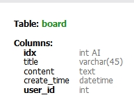

nodejs,mysql2/promise,express,ejs

# CRUD 게시판 만들기.
## 0. previous assignment
```javascript
var express = require('express')
var app = express();
const PORT = process.env.PORT = 3336;

app.listen(PORT,() => {
    console.log('Server is running at:',PORT)
});

var mysql = require('mysql2/promise'); //

var pool = mysql.createPool({ //
    host: "localhost",
    user: "root",
    password: "0613",
    database: "crud"
});

app.locals.pretty = true; //
var ejs = require('ejs')
app.set('views', __dirname + '/views');
app.set('view engine','ejs');

var bodyParser = require('body-parser'); 
app.use(bodyParser.json());
var urlencodedParser = app.use(bodyParser.urlencoded({ extended: false })); // 

```
* node js express 모듈을 통해 서버 연결 (port:3336)
* mysql2/promise 모듈을 통해 mysql 서버, 해당 테이블 연결
* views 파일의 ejs 폴더를 view engine으로 지정
* body-parser 모듈로 post method로 받아온 body값들을 탐색 가능
  
## 1. create 
* 게시판에 글(데이터)을 생성하는 기능을 구현하고자 한다. 
* front end (웹 브라우저 html/ejs), back end (서버, db) 코드를 작성한다. 
### 1.1 back/DB-mysql  



* '작성자'와 '글'에 대한 data를 게시판에서 생성하여 db로 받아오기 위해, 테이블을 2개 구성한다. 
* user 테이블 구성: 작성자에 대한 정보 - idx (pk), name, age, password
* board 테이블 구성: 게시판 글에 대한 정보 - id (pk), title, content, create_time, user_id 
* cf. 데이터의 무결성과 효율적인 관리를 위해 board 테이블에 user 테이블을 참조하는 외래키 컬럼 ('user_id')을 지정한다.  


### 1.2 front - ejs 
```html
<!DOCTYPE html>
<html>
<head>
    <title><%= title %></title>
    <link rel='stylesheet' href='/stylesheets/style.css'/>
</head>
<body>
<h1><%= title %></h1>
<form action="/board/write" method="post">
    <table border="1">
        <tr>
            <td>작성자</td>
            <td><input type="text" name="name" id="name" required/></td>
        </tr>
        <tr>
            <td>연령</td>
            <td><input type="text" name="age" id="age" required/></td>
        </tr>
        <tr>
            <td>제목</td>
            <td><input type="text" name="title" id="title" required/></td>
        </tr>
        <tr>
            <td>내용</td>
            <td><textarea name="content" id="content" cols="30" rows="10" required></textarea></td>
        </tr>
            <td>작성자 패스워드</td>
            <td><input type="password" name="password" id="password" required/></td>
        </tr> 
        <tr>
            <td colspan="2">
                <button type="submit">글쓰기</button>
            </td>
        </tr>
    </table>
</form>
</body>
</html>
```

* <%= title %>: 'title'변수를 지정하여 서버에서 할당한 tile 변수의 값을 가져와 ejs에서 사용할 수 있게 한다. 
* ``` <form action="/board/write" method="post"> <table> ``` : 작성자, 연령, 제목, 내용, 작성자 패스워드에 대한 table 값을 클라이언트단에서 submit할 경우,그 값들을 "/board/write" 경로에 'post'method 형태로 받아온다. 
<br><br>


* 웹 브라우저에서 보여지는 모습 
<br>

### 1.3 back/server-node.js 

#### 1.3.1 get
```javascript
app.route('/board/write') 
  .get(function (req, res) {
    res.render('write',{title: '글 작성하기'});
  })
  // get은 밑 "read(1)"에서 설명
```
* app.route('/board/write'): '/board/write' 경로로 요청받는 것들 (get, post)을 한번에 코드로 묶어 처리해준다. 
* get: get 방식으로 접근할 때 'write' ejs를 렌더링하여 브라우저에 보여주고, title 변수에 '글 작성하기' 값을 넣어준다. (read part)

#### 1.3.2 post 
##### (1) user 테이블에 값 받아오기
```javascript
  .post(function (req, res) {
    const connection = pool.getConnection(conn=> conn)
      try {
        var sql_u = "INSERT INTO user (name, age, password) VALUES (?,?,?)";
        let item_u = [
          req.body.name,
          req.body.age,
          req.body.password
        ]
        var insertId;
        connection.beginTransaction(); 
        insertId = connection.query(sql_u, item_u);
        insertId = insertId[0].insertId
      await connection.commit(); // COMMIT
      }
      catch(err){
        connection.rollback(); // ROLLBACK
        connection.release();
        console.log('user Query Error');
        return false;
      };
      
      console.log('table is completed')
      connection.release();
      res.redirect('/');
    });

```

* ``` const connection = pool.getConnection(conn=> conn)``` : mysql 연결 
* 트랜잭션을 만든다. 
* sql문으로 user 테이블 컬럼 값에 해당되는 것부터 먼저 가져오고, 쿼리문 실행. 쿼리문이 정상적으로 작동되면 값 중 user테이블의 id값에 해당하는 값을 insertId 변수에 할당한다. 
* 에러가 날 경우, 앞에서 명령했던 것들을 무효화 시키고 sql 연결을 끊는다. 또한, user 쿼리 에러 문구를 보여주게 한다.  
* 에러가 나지 않을 경우, table is completed 문구를 보여주고 홈 화면을 리다이렉트한다. 

##### (2) board 테이블에 값 받아오기
* board.user_id 가 FK로 user.id를 참조하므로 데이터의 무결성을 위해 user 테이블의 값을 먼저 가져와서, insertID (=user 테이블의 id값 할당) 변수에 값을 할당한 뒤에 board 테이블 값을 받아와야한다. 
* 따라서, 비동기를 동기화 시키기 위해 post 함수에 async, user 테이블 명령에 await를 사용한다. 
* 트랜잭션에 board 값을 가져오는 try문을 추가하여 하나의 트렌젝션 안에서 운용한다. 
  

```javascript
  .post(async function (req, res) {
    const connection = await pool.getConnection(conn=> conn)
      try {
        var sql_u = "INSERT INTO user (name, age, password) VALUES (?,?,?)";
        let item_u = [
          req.body.name,
          req.body.age,
          req.body.password
        ]
        var insertId;
        await connection.beginTransaction(); // START TRANSACTION > transaction 알기 + transaction에 따른 pool 접근 방식 
        insertId = await connection.query(sql_u, item_u);
        insertId = insertId[0].insertId
      try {
        var sql_b = "INSERT INTO board (title, content, user_id, create_time ) VALUES (?,?,?,now())";
        console.log(sql_b)
        let item_b = [
          req.body.title,
          req.body.content,
          insertId
        ]
        await connection.query(sql_b,item_b);
      }
          catch(e){
            console.log('board Query Error')
            await connection.rollback();
            connection.release();
          };
      await connection.commit(); // COMMIT
      }
      catch(err){
        await connection.rollback(); // ROLLBACK
        connection.release();
        console.log('user Query Error');
        return false;
      };
      
      console.log('table is completed')
      connection.release();
      res.redirect('/');
    });
```
* sql_b로 board의 제목, 내용, user_id, create_time을 insert한다.
* user_id는 user 테이블의 id값인 insertID 를 넣어주고, create_time은 now()를 통해 처리해준다.
* sql_b에서 에러가 나면 데이터의 무결성을 위해 롤백하여 앞의 명령을 무효화 시키고 sql 연결을 끊은 뒤 board 쿼리 에러 메시지를 보내주게 한다. 
* user, board의 insert 과정을 commit 한다. 


## 2. read 
### 2.1 <홈 화면에서 전체 글 리스트 보여주기.>
### 2.1.1 Back (DB/server)
```javascript
app.get('/', function(req, res) {
  var sql = "SELECT * FROM board LEFT JOIN user ON board.user_id = user.id";
  pool.query(sql, function (err, rows) {
      // console.log(rows)
      if (err) console.error("err : " + err);
      res.render('list', {title: '게시판 리스트', rows: rows});
  });
});
```
* '/' 으로 get method가 요청될 때, mysql의 board, user 테이블의 데이터를 모두 select 한다. left join을 활용하여 board의 user_id와 user의 id가 일치하도록 테이블을 join하여 모든 데이터를 불러온다. 
* sql 쿼리문이 문제 없으면, 그 값들을 rows 변수에 할당한다. 
* 'list' ejs 파일을 렌더링하여 ejs 'title' 변수에 '게시판 리스트', 'rows' 변수에 rows 값을 사용한다. 
  
### 2.1.2 Front (list.ejs)
```html
<!DOCTYPE html>
<html>
<head>
    <title><%= title %></title>
    <link rel='stylesheet' href='/stylesheets/style.css'/>
</head>
<body>
<h1><%= title %></h1>
<a href="/board/write">글쓰기</a>
<table border="1">
    <tr>
        <td>번호</td>
        <td>작성자</td> 
        <td>제목</td>
        <td>등록일</td>
        <!-- <td>글 삭제</td> -->
    </tr>
    <%
    for(var i=0; i<rows.length; i++) 
    {
        var data = rows[i];
    %>
    <tr>
        <td><%=data.idx%></td>
        <td><%=data.name%></td>
        <td><a href="/board/read?id=<%=data.idx%>"><%=data.title%></a></td> 
        <td><%=data.create_time%></td>
        <!-- <form action="/board/delete" method="post">
            <input type="hidden" name="idx" value="<%=data.idx%>"/>
            <td> <button type="submit">삭제</button></td> 
        </form> -->
    </tr>
    <%}%>
</table>
</body>
</html>

```
* ```<a href="/board/write">글쓰기</a>```: #1에서 만든 글 생성 기능을 사용하기 위해 href를 통해 해당 경로로 get 요청을 받을 수 있게 한다. > /board/write로 get 요청이 올 시 'write' ejs를 렌더링할 수 있게 하는 코드를 추가한다. 
  
```javascript
app.route('/board/write') 
  .get(function (req, res) {
    res.render('write',{title: '글 작성하기'});
  })
```

* board, user 테이블의 값 중에 홈 화면 '글 리스트' 영역에서는 글번호, 작성자, 제목, 등록일만 테이블 형식으로 보여준다. 각각 해당 sql 테이블 컬럼 값을 지정해서 가져온다. 가져올 때, data라는 변수에 서버에서 받아온 rows 변수 한 행씩을 할당하여 가져온다. 
* ```<td><a href="/board/read?id=<%=data.idx%>"><%=data.title%></a></td> ```: 제목 변수에는 제목을 눌렀을 때 글 상세페이지를 볼 수 있도록 href를 걸어준다. /board/read path에 각각 글번호마다 다른 id값을 부여하여 해당하는 내용들을 보여주기 위해 query string (id)을 이용한다. 

* write-read list (for now) <br>


### 2.2 <상세페이지 보여주기>
#### 2.2.1 front
```html
<!DOCTYPE html>
<html>
<head>
    <title><%= title %></title>
    <link rel='stylesheet' href='/stylesheets/style.css'/>
</head>
<body>
<h1><%= title %></h1>
 
<form action="/board/update" method="post">
    <table border="1">
        <input type="hidden" name="idx" value="<%=row.idx%>"/>
        <tr>
            <td>작성자</td>
            <td><input type="text" name="name" id="name" value="<%=row.name%>" required/></td>
        </tr>
        <tr>
            <td>제목</td>
            <td><input type="text" name="title" id="title" value="<%=row.title%>" required/></td>
        </tr>
        <tr>
            <td>내용</td>
            <td><textarea name="content" id="content" cols="30" rows="10" required><%=row.content%></textarea></td>
        </tr>
        <tr>
            <td>패스워드</td>
            <td><input type="password" name="password" id="password" required/></td>
        </tr>
        <tr>
            <td>등록일</td>
            <td><%=row.create_time%></td>
        </tr>
        <tr>
            <td colspan="2">
                <button type="submit">글 수정</button>
                <a href="/">목록</a>
            </td>
        </tr>
    </table>
</form>
</body>
</html>

```
    * 글 작성하기 (write)와 비슷한 포멧으로 상세페이지를 보여줄 read.ejs 파일을 만든다.다만, 글 수정이 가능하게끔 글 수정 버튼과 홈화면-글 list로 다시 돌아갈 수 있는 '목록' url을 만들어준다. 
    * list.ejs 파일에서 제목을 클릭하면 상세페이지에 들어갈 수 있게 /board/read로 path를 지정하고, ?id=<%=data.idx 로 글번호 쿼리스트링 id값을 부여하였었다. 
    * hidden값으로 idx를 지정하여 브라우저상에서는 보여지지 않지만 idx 값을 탐색할 수 있도록 한다. 

#### 2.2.2 back (server, DB)
```javascript
app.get('/board/read',function(req,res){
  var idx = req.query.id;
  console.log(idx)
  var sql = "SELECT name, title, create_time, content, password, idx FROM board LEFT JOIN user ON board.user_id = user.id WHERE idx = " + idx;
  pool.query(sql,function(err,row){
    if (err) console.error(`err: ${err}`);
    // console.log(row)
    res.render('read', {title:"글 상세보기",row:row[0]});
  });
});
```

* /board/read 경로로 get 요청이 들어올 경우, function 실행. read ejs를 렌더링한다. 
* idx값을 가져와야 해당 글 번호에 대한 상세페이지를 보여줄 수 있으므로, idx값을 req.query로 가져온다. 
* select, left join으로 상세페이지에서 보여줄 요소들을 가져오고, where절로 idx값이 같은 경우로 제한한다.
* pool.query로 위의 sql문이 이상 없을 경우 row 변수로 값을 받아오도록 한다.
* read.ejs title 변수에 '글 상세보기', row 변수에 sql 값 할당했던 값을 부여한다. row는 idx 값이 같을 경우에만 가져오므로 하나의 행이다. 따라서 row[0]을 가져오면 된다. 


## 3. update
### 3.1 back (server, DB)
```javascript
app.post('/board/update',function(req,res){
  var name = req.body.name
  var title = req.body.title
  var content = req.body.content
  var password = req.body.password
  var idx = req.body.idx

  try{
    var sql = "UPDATE board LEFT JOIN user ON board.user_id = user.id SET user.name = '" + name + "' ,board.title = '" + title + "' ,board.content = '" + content + "' WHERE board.idx = " +idx+ " AND user.password = '" + password + "'" ;
    pool.query(sql, function (err,result_ud){
      if (err) console.error ('err : '+ err)
      console.log(result_ud)
      res.redirect('/')
    });
  }
  catch(e){
    console.log(e)
  }
});

```
* <'read'ejs 참고>'/board/update' 경로로 post 요청이 올 경우, 해당 함수를 실행한다. 
* 이름, 제목, 내용, 패스워드, 글번호를 변수로 지정하여 body-parser로 가져온다. 
* left join을 활용한 update sql문을 통해 작성자 이름, 글 제목, 글 내용 컬럼을 수정할 수 있다.
* where절로 글번호(idx),패스워드가 같을 경우에만 수정가능하도록 제한한다. 
* 수정이 다 되면 홈 화면으로 리다이렉트한다.

* 글 수정 <br>

* 글 수정 확인 <br>


## 4. delete
### 4.1 front (list.ejs) 추가 
```html
<table border="1">
    <tr>
        <td>번호</td>
        <td>작성자</td> 
        <td>제목</td>
        <td>등록일</td>
        <td>글 삭제</td> 
    </tr>
    <%
    for(var i=0; i<rows.length; i++) 
    {
        var data = rows[i];
    %>
    <tr>
        <td><%=data.idx%></td>
        <td><%=data.name%></td>
        <td><a href="/board/read?id=<%=data.idx%>"><%=data.title%></a></td> 
        <td><%=data.create_time%></td>
        <form action="/board/delete" method="post">
            <input type="hidden" name="idx" value="<%=data.idx%>"/>
            <td> <button type="submit">삭제</button></td> 
        </form>
    </tr>
    <%}%>
```
* 홈화면 리스트 '글 삭제' 버튼을 추가해준다.
* /board/delete 경로에 post로 요청을 하며, 글 번호값을 hidden 값으로 지정해준다. 
### 4.2 back (server,DB)
```javascript
app.post('/board/delete',function(req,res){
  var idx = req.body.idx
  console.log(idx)
  try{
    var sql = "DELETE board, user FROM board LEFT JOIN user ON board.user_id = user.id WHERE idx = " + idx;
    pool.query(sql, function(err){
      if (err) console.log(err)
      res.redirect('/')
    })
  }
  catch(e){
    console.log(e)
  }
});
```
* post로 해당 경로에 요청이 들어오면 function을 실행한다. 
* left join을 활용한 delete sql문을 통해 글 삭제를 한다. 하지만, 글 삭제 버튼을 누를 경우 글번호(idx) 값이 일치한 글 데이터만 지워줘야하므로 where절을 통해 제한해준다.(hidden 값 이용)
* 글을 다 삭제하면 홈화면을 리다이렉트해준다.

* 글 삭제 완료 <br>
 
